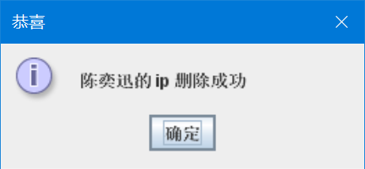

# 通讯录管理系统

## 项目概述

通讯录管理系统，是一个管理用户ip地址的系统。登录成功后，即可进入系统查看所有人的ip地址。也可对每条记录进行增删改查，排序功能。

由于是管理ip地址的通讯录，我没想到应该统计什么，故无统计功能。

通讯功能实质就是查询，查到对方姓名后，聊天室窗口显示对方ip地址，（目前仅提供在JTextField输入，将消息发到JTextArea。网络编程尚未开发完毕，敬请期待~~）

## 功能描述

### 数据库的2个表

### 通讯录功能图

## 功能演示

### 注册

因为id作为主键，因此id重复

Id不重复，则注册成功

### 登录

### 增加

点击升降序，可以顺带刷新

### 修改

### 删除

输入错误的对话框

输入正确，找到此人直接删除

点击确定后删除通讯ip的窗口也同时关闭

此时再次点击升降序，发现陈奕迅已经消失

### 升降序

点击升降序，可以刷新，也可以升降序

### 通讯

目前只支持发送功能，不支持客户端连接服务端

## UML类图

### 1. 注册

### 2. 登录

### 3. 查看

### 4. 添加

### 5. 删除

### 6. 修改

### 7. 通讯

## 感想

很高兴做出了人生中第一个系统~ 数据库的 ’user’ 表记录了我的崩溃瞬间：

测试过程中过于疲惫哈哈哈~~~

有一次不小心把新窗口加在了错误的位置，点击了几次按钮都看似没有反应，将窗口拉开才发现，创建了好多个窗口：

## 遇到的问题及解决方法

- 

  由于执行了rs = stmt.executeQuery(sql);

  rs就会被关闭掉！所以程序执行到此会提示ResultSet已经关闭了

  感谢这篇文章的博主：

  <https://blog.csdn.net/hellobobantang/article/details/7173622>

  我再将executeQuery后面的rs.getString注释，在executeQuery运行前拿另一个变量提前获取了，问题便解决了。

- id重复的问题在navicat里将id设置为主键即可，然后代码那里catch到异常，则通过一个消息对话警告报错。